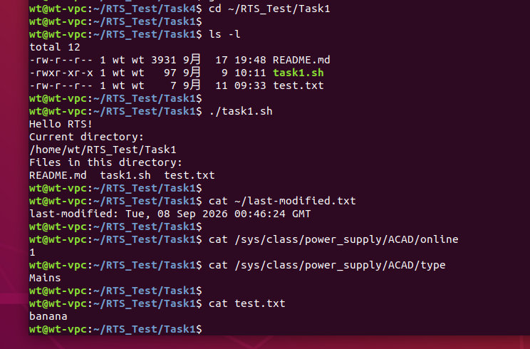

# Task1：初入命令行

## 1. Shell 环境

使用以下命令查看当前使用的 Shell：

```bash
echo $SHELL
```

运行结果：

```text
/bin/bash
```

说明当前使用的是 Bash。

## 2. 创建目录和文件

在 `/tmp` 目录下创建 `missing` 目录：

```bash
mkdir /tmp/missing
```

进入该目录：

```bash
cd /tmp/missing
```

使用 `touch` 创建 `semester` 文件：

```bash
touch semester
```

使用以下命令查看文件信息：

```bash
ls -l semester
```

此时 `semester` 已经创建，但还没有执行权限。

## 3. 编写 Shell 脚本

向 `semester` 文件中写入：

```bash
echo '#!/bin/sh' > semester
echo 'curl --head --silent https://missing.csail.mit.edu' >> semester
```

查看文件内容：

```bash
cat semester
```

文件内容为：

```bash
#!/bin/sh
curl --head --silent https://missing.csail.mit.edu
```

其中 `>` 会创建文件（若文件已存在则覆盖原内容），`>>` 表示在文件末尾追加内容。

## 4. 文件执行权限

刚创建的 `semester` 文件没有执行权限，直接运行：

```bash
./semester
```

会得到：

```text
bash: ./semester: Permission denied
```

使用 `ls -l` 查看权限：

```bash
ls -l semester
```

可以看到此时权限中没有 `x`，因此不能通过 `./semester` 直接执行。

但是可以使用 Shell 解释器读取并执行该文件：

```bash
sh semester
```

这里真正被执行的是 `/bin/sh`，`semester` 作为参数交给 `sh` 读取，因此 `semester` 本身不需要具有执行权限。

给 `semester` 添加执行权限：

```bash
chmod +x semester
```

再次查看权限：

```bash
ls -l semester
```

此时权限中出现 `x`。

之后可以直接运行：

```bash
./semester
```

脚本能够正常执行。

其中，脚本第一行：

```bash
#!/bin/sh
```

称为 shebang，用于指定直接执行该脚本时所使用的解释器。

## 5. 管道与输出重定向

使用管道 `|` 将前一个命令的输出交给后一个命令处理：

```bash
./semester | grep last-modified
```

其中 `grep last-modified` 会筛选出包含 `last-modified` 的行。

再使用 `>` 将筛选结果写入家目录下的文件：

```bash
./semester | grep last-modified > ~/last-modified.txt
```

查看保存结果：

```bash
cat ~/last-modified.txt
```

`>` 在目标文件不存在时会自动创建文件；如果文件已经存在，则会覆盖原有内容。

## 6. 通过 /sys 查看硬件状态

Linux 可以通过 `/sys` 虚拟文件系统向用户提供部分设备和硬件状态信息。

首先查看电源设备：

```bash
ls /sys/class/power_supply/
```

运行结果：

```text
ACAD
```

当前 VMware 虚拟机只检测到 `ACAD`，没有检测到常见的电池设备 `BAT0`。

查看 `ACAD` 提供的接口：

```bash
ls /sys/class/power_supply/ACAD/
```

其中可以看到 `online`、`type` 等文件。

读取当前电源状态：

```bash
cat /sys/class/power_supply/ACAD/online
```

运行结果：

```text
1
```

`1` 表示当前 AC 电源处于在线状态。

查看电源类型：

```bash
cat /sys/class/power_supply/ACAD/type
```

运行结果：

```text
Mains
```

此外，尝试寻找 CPU 温度接口：

```bash
ls /sys/class/thermal/
```

当前环境只显示：

```text
cooling_device0  cooling_device1
```

没有 `thermal_zone0`。继续检查：

```bash
ls /sys/class/hwmon/
```

也没有发现可读取的温度传感器接口。

因此，当前 VMware 虚拟机没有暴露宿主机的电池电量或 CPU 温度传感器，无法直接完成电池电量或 CPU 温度的读取。但通过读取 `ACAD/online` 和 `ACAD/type`，验证了通过 `/sys` 文件接口获取设备状态的方法。

## 运行结果

以下截图展示了本任务中部分命令行操作的实际运行结果：



截图中包含：

- `ls -l`：查看文件详细信息以及文件权限，其中 `task1.sh` 具有可执行权限。
- `./task1.sh`：直接执行 Shell 脚本，输出当前目录以及目录中的文件。
- `cat ~/last-modified.txt`：查看通过管道、`grep` 和输出重定向得到的 HTTP `last-modified` 信息。
- `cat /sys/class/power_supply/ACAD/online`：读取虚拟文件系统中的电源状态，结果为 `1`，表示交流电源在线。
- `cat /sys/class/power_supply/ACAD/type`：读取电源类型，结果为 `Mains`。
- `cat test.txt`：查看重定向练习产生的文本文件内容。

## 7. 总结

通过本次练习，我学习了 Linux Shell 的基本使用，包括目录和文件操作、文件权限、Shell 脚本执行、管道、输出重定向以及 `/sys` 文件系统的基本使用。


