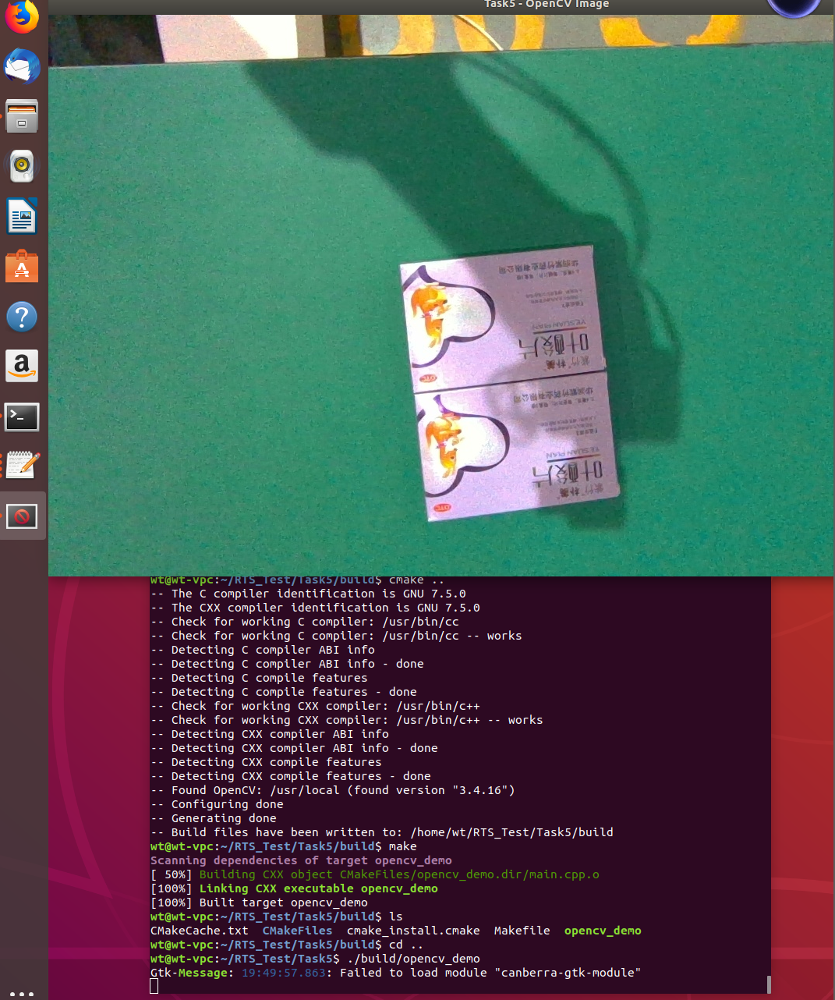

# Task5：源码编译安装 OpenCV 并使用 CMake 构建项目

## 1. 任务目标

本任务通过源码编译的方式安装 OpenCV，并使用 C++ 编写一个简单的图像显示程序，通过 CMake 完成项目构建。

本次使用环境：

- Ubuntu 18.04
- CMake 3.10.2
- g++ 7.5.0
- OpenCV 3.4.16

## 2. OpenCV 源码编译

首先获取 OpenCV 3.4.16 源码：

```bash
git clone --depth 1 --branch 3.4.16 git@github.com:opencv/opencv.git opencv-3.4.16
```

创建独立的构建目录：

```bash
cd ~/opencv-3.4.16
mkdir build
cd build
```

使用 CMake 配置项目：

```bash
cmake -D CMAKE_BUILD_TYPE=Release \
      -D CMAKE_INSTALL_PREFIX=/usr/local \
      -D BUILD_TESTS=OFF \
      -D BUILD_PERF_TESTS=OFF \
      -D BUILD_EXAMPLES=OFF \
      ..
```

其中：

- `CMAKE_BUILD_TYPE=Release`：使用 Release 模式进行编译
- `CMAKE_INSTALL_PREFIX=/usr/local`：指定 OpenCV 的安装位置
- `BUILD_TESTS=OFF`：不编译测试程序
- `BUILD_PERF_TESTS=OFF`：不编译性能测试
- `BUILD_EXAMPLES=OFF`：不编译官方示例

随后进行源码编译：

```bash
make -j2
```

编译完成后安装 OpenCV：

```bash
sudo make install
sudo ldconfig
```

最终 OpenCV 3.4.16 被安装到 `/usr/local`。

## 3. OpenCV C++ 程序

本项目使用 OpenCV 读取并显示一张图片。

`main.cpp`：

```cpp
#include <opencv2/opencv.hpp>
#include <iostream>

int main()
{
    cv::Mat image = cv::imread("image.jpg");

    if (image.empty())
    {
        std::cerr << "Failed to load image." << std::endl;
        return -1;
    }

    cv::imshow("Task5 - OpenCV Image", image);

    cv::waitKey(0);

    return 0;
}
```

其中：

- `cv::Mat`：OpenCV 中常用的图像/矩阵数据类型
- `cv::imread()`：从文件读取图像
- `cv::imshow()`：创建窗口并显示图像
- `cv::waitKey(0)`：等待键盘输入，使窗口保持显示

## 4. CMakeLists.txt

项目使用 CMake 管理构建过程：

```cmake
cmake_minimum_required(VERSION 3.10)

project(Task5_OpenCV)

find_package(OpenCV REQUIRED)

add_executable(opencv_demo main.cpp)

target_link_libraries(opencv_demo ${OpenCV_LIBS})
```

其中：

- `find_package(OpenCV REQUIRED)`：查找系统中安装的 OpenCV
- `add_executable()`：将 `main.cpp` 编译为可执行程序 `opencv_demo`
- `target_link_libraries()`：将 OpenCV 库链接到可执行程序

CMake 配置时成功检测到源码安装的 OpenCV：

```text
Found OpenCV: /usr/local (found version "3.4.16")
```

## 5. 项目编译与运行

创建独立构建目录：

```bash
mkdir build
cd build
cmake ..
make
```

成功生成可执行程序：

```text
[100%] Linking CXX executable opencv_demo
[100%] Built target opencv_demo
```

由于程序使用相对路径 `image.jpg`，从 Task5 项目根目录运行：

```bash
./build/opencv_demo
```

程序成功读取并显示图片。

## 6. 运行结果



## 总结

通过本任务完成了 OpenCV 3.4.16 的源码下载、CMake 配置、编译和安装，并使用 C++ 调用 OpenCV 的图像读取与显示功能。最后使用 CMake 构建自己的 OpenCV 项目，进一步理解了 CMake、编译器以及第三方库之间的关系。
