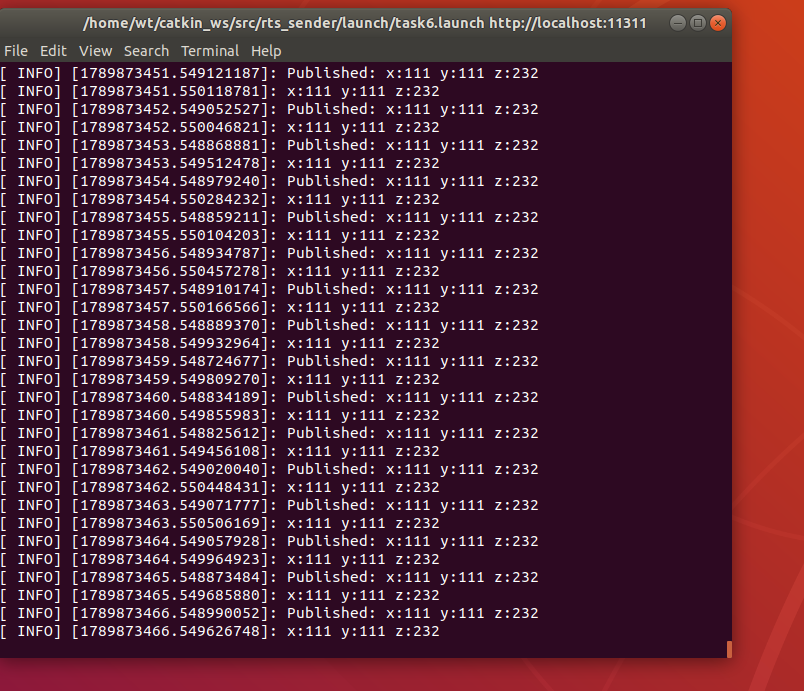

# Task6：ROS Topic 通信与自定义消息

## 1. 任务内容

本任务基于 ROS1 Melodic，使用 C++ 编写两个 ROS 功能包：

- `rts_sender`：发布消息
- `rts_receiver`：订阅消息

两个节点通过 ROS Topic 进行通信。

消息中包含三个 `int64` 类型的数据，并按照任务要求使用自定义 `.msg` 消息类型。

最终使用 `.launch` 文件同时启动发送节点和接收节点。

---

## 2. ROS Topic 通信结构

本任务的数据流如下：

```text
sender_node
    |
    | publish
    v
/three_ints
    |
    | subscribe
    v
receiver_node
```

`sender_node` 将数据发布到 `three_ints` 话题。

`receiver_node` 订阅同一个话题，当收到消息后执行回调函数，并将三个整数输出到终端。

---

## 3. 自定义消息

自定义消息文件位于：

```text
rts_sender/msg/ThreeInts.msg
```

内容为：

```text
int64 x
int64 y
int64 z
```

该消息包含三个 64 位整数。

在 `rts_sender/CMakeLists.txt` 中通过：

```cmake
add_message_files(
  FILES
  ThreeInts.msg
)

generate_messages(
  DEPENDENCIES
  std_msgs
)
```

配置 ROS 消息生成。

执行 `catkin_make` 后，catkin 会根据 `ThreeInts.msg` 自动生成 C++ 可以使用的消息头文件，例如：

```text
devel/include/rts_sender/ThreeInts.h
```

因此 C++ 程序中可以使用：

```cpp
#include <rts_sender/ThreeInts.h>
```

---

## 4. 发布节点

发布节点位于：

```text
rts_sender/src/sender.cpp
```

节点创建一个 Publisher，并向 `three_ints` 话题发布 `ThreeInts` 消息。

本次测试使用的数据为：

```text
x = 111
y = 111
z = 232
```

发布端运行时输出：

```text
Published: x:111 y:111 z:232
```

---

## 5. 接收节点

接收节点位于：

```text
rts_receiver/src/receiver.cpp
```

接收节点订阅：

```text
three_ints
```

话题。

当收到消息时，ROS 调用回调函数读取消息中的 `x`、`y`、`z`，并输出：

```text
x:111 y:111 z:232
```

`rts_receiver` 使用了 `rts_sender` 中定义的 `ThreeInts` 消息，因此在 `CMakeLists.txt` 和 `package.xml` 中声明了对 `rts_sender` 的依赖。

---

## 6. Launch 文件

Launch 文件位于：

```text
rts_sender/launch/task6.launch
```

其中同时启动两个节点：

```xml
<launch>
    <node pkg="rts_sender"
          type="sender_node"
          name="sender_node"
          output="screen" />

    <node pkg="rts_receiver"
          type="receiver_node"
          name="receiver_node"
          output="screen" />
</launch>
```

使用以下命令启动：

```bash
source ~/catkin_ws/devel/setup.bash
roslaunch rts_sender task6.launch
```

使用 `roslaunch` 后可以同时启动发送节点和接收节点，不需要分别使用 `rosrun` 启动。

---

## 7. 运行结果

程序运行后，发送节点持续发布三个整数，接收节点能够正确接收并显示：

```text
Published: x:111 y:111 z:232
x:111 y:111 z:232
```

运行效果截图：



---

## 8. 实现过程中遇到的问题

在第一次编译发送节点时出现：

```text
fatal error: rts_sender/ThreeInts.h: No such file or directory
```

检查后发现 `CMakeLists.txt` 中的 `add_message_files()` 和 `generate_messages()` 仍处于注释状态，因此虽然存在 `ThreeInts.msg`，但 catkin 没有生成对应的 C++ 消息头文件。

取消注释并重新执行：

```bash
catkin_make
```

后成功生成 `ThreeInts.h`，发送节点和接收节点均能够正常编译运行。

---

## 9. 总结

通过本任务完成了 ROS1 中基本的 Topic 发布与订阅通信，并学习了：

- ROS Package 的基本结构
- Publisher 与 Subscriber
- Topic 通信机制
- 自定义 `.msg` 消息
- ROS 功能包之间的依赖关系
- `catkin_make` 的消息生成和编译过程
- 使用 `.launch` 文件同时启动多个 ROS 节点

最终实现了发送节点发布三个 `int64` 数据，接收节点订阅并显示数据，并通过 Launch 文件统一启动两个节点。
